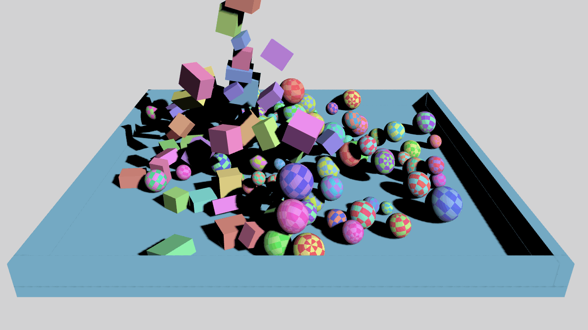

# ThreeFiz

Implementation of a physics engine based on the [Three.js](https://github.com/mrdoob/three.js) library.

### [Demo](https://bklzn.github.io/ThreeFiz/)



### Installation

> npm i threefiz

### Features

- Rigid body dynamics
- Collision detecion of OBB's objects
- Library presents 3 collision relations for now
  - sphere - sphere
  - OBB - OBB
  - OBB - sphere

### Example

This example creates a three.js environment and then adds a perpendicular and a sphere

```js
import * as THREE from "three";
import ThreeFiz from "threefiz";

const scene = new THREE.Scene();
const camera = new THREE.PerspectiveCamera(
  45,
  window.innerWidth / window.innerHeight,
  1,
  10000
);

const renderer = new THREE.WebGLRenderer();
renderer.setSize(window.innerWidth, window.innerHeight);
document.body.appendChild(renderer.domElement);

const light = new THREE.DirectionalLight(0xffffff, 3);

const geometry = new THREE.SphereGeometry(1);
const material = new THREE.MeshPhongMaterial({ color: 0x0000ff });
const sphere = new THREE.Mesh(geometry, material);

const floorGeometry = new THREE.BoxGeometry(10, 1, 10);
const floorMaterial = new THREE.MeshPhongMaterial({ color: 0xff0000 });
const floor = new THREE.Mesh(floorGeometry, floorMaterial);
const physic = new ThreeFiz({ scene });
physic.addSphere({
  mesh: sphere,
  mass: 10,
  restitution: 0.2,
  isStatic: false,
  position: new THREE.Vector3(0, 20, 0),
});

physic.addBox({
  mesh: floor,
  mass: 10,
  restitution: 0.2,
  isStatic: true,
});

physic.init();

scene.add(light);

camera.position.set(0, 10, 50);
light.position.set(500, 500, 500);

let animate = () => {
  physic.step();
  renderer.render(scene, camera);
  requestAnimationFrame(animate);
};

animate();
```
